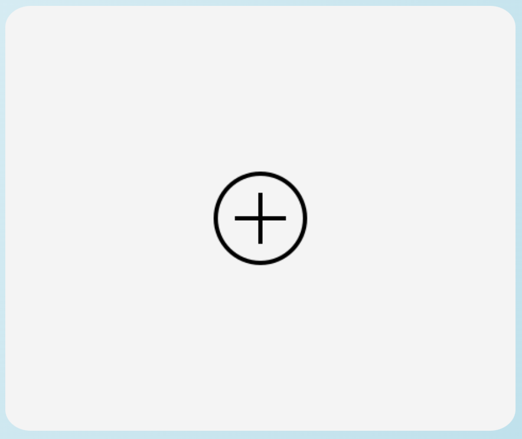
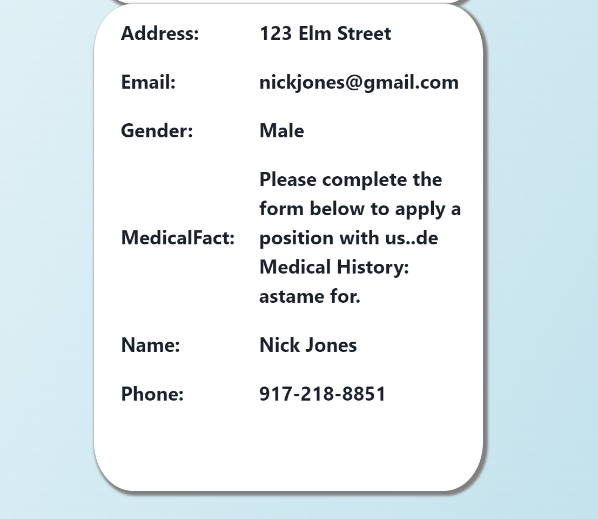
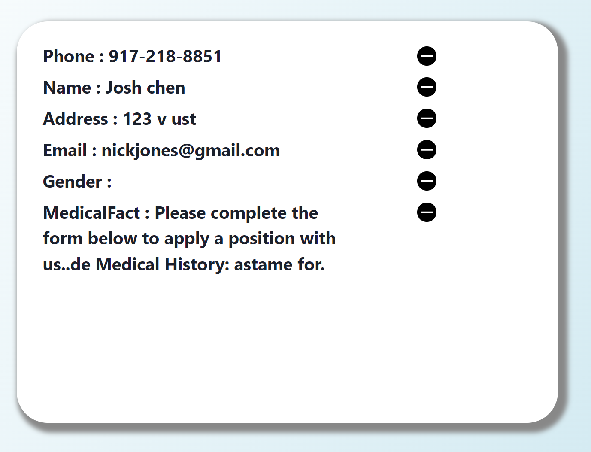

<p align="center">
    
</p>

<h1 align="center" style="margin-top: 0px;">StudyFind Front End Development </h1>

[](https://github.com/michaelohyang/OCR-web/actions/workflows/client.yml)

## Installation

This module is created and runs via [npm](https://www.npmjs.com/) which is bundled with [node](https://nodejs.org/en/), therefore please ensure that you have node and npm installed. For more information on the dependecies, you can check it out in the package.json file. Please ensure that you are in the frontend directory in your terminal and run the following commands:

```
npm install
npm start
```

> Remember to start your backend server as well by navigating to the backend folder. Please read the README.md file in that folder as well. 👍

## Page Components

There are a total of 5 pages in the src folder. More information of each page can be found below:

- `ViewProjectPage`: First page of the web application. You can view available projects of each client in this page.
- `CreateNewProjectPage`: Create a project for a new client.
- `ExistDigitalForm`: You can view existing project information for a existing individual client.
- `UploadFilesScreen`: You are able to upload digital medical record images for the individual client.
- `ConfirmDigitalForm`: You are able to modify the attributes of the parsed information from the medical record images

## How To Use Our Web Application

1. Boot up our application by running the command above
2. Select an existing project that you would like to view or modify

   - If you want to create a new project for a client, then navigate down the website until you can see the ADD Project Modal
    <p align="center">
   
    </p>

   - Fill Out the required information and then submit

3. Once you select a project for a clent, you will be able to see the available medical records for that individual. Proceed to the next page if you want to upload more medical records for that individual.
    <p align="center">
   
    </p>
4. Upload a medical record image or multiple medical record images by clicking on the add modal. Once you are done adding, click submit.
5. View the attributes on the left side of page and modify the attributes as you need. You are able manually add or delete attribues on the right side of the page. You can delete existing attributes on the left side of the page.
    <p align="center">
   
    </p>

## Credits

```
Jiaxuan Chen, Chenyu Dai, Shuge Fan, Michael Oh-Yang, Peiqi Zhao
```
